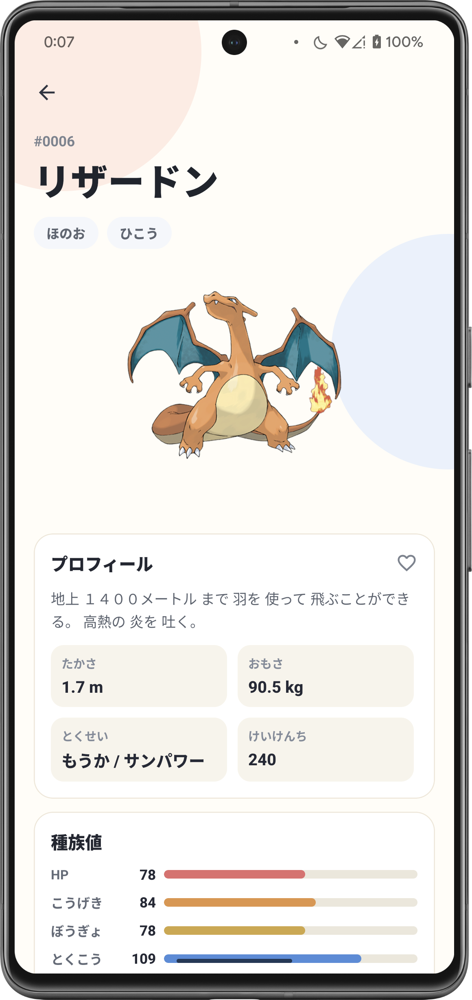

# react-native-pokedex-expo

Expo + React Native + Expo Router で構築した、PokeAPI ベースの Pokédex アプリです。  
ポケモン一覧表示、タイプ絞り込み、詳細表示（種族説明・能力・進化・技・種族値）に対応しています。

## 主な機能

- ポケモン一覧の無限スクロール表示
- タイプ別フィルター（全18タイプ）
- ポケモン詳細表示
  - 日本語名
  - 図鑑説明
  - 高さ / 重さ / 特性 / 経験値
  - 種族値（レーダー + バー）
  - 進化系統
  - 技一覧（段階的に追加表示）

## スクリーンショット

| 一覧画面 | 詳細画面 |
| --- | --- |
|  |  |

## 技術スタック

- Expo SDK 55
- React Native 0.83
- Expo Router
- TanStack Query
- Axios
- Zod

## セットアップ

```bash
npm install
```

## 開発コマンド

```bash
npm run start      # Expo 開発サーバー
npm run ios        # iOS 実行
npm run android    # Android 実行
npm run web        # Web 実行
```

## 品質チェック

```bash
npm run lint
npm run type-check
npm run format:check
```

自動修正:

```bash
npm run lint:fix
npm run format
```

## API 設定

`app.config.ts` の `expo.extra.apiBaseUrl` から API ベース URL を参照します。  
未指定時のデフォルトは `https://pokeapi.co/api/v2` です。

例:

```bash
API_BASE_URL=https://pokeapi.co/api/v2 npm run start
```

## ディレクトリ構成

```text
app/                         # Expo Router の画面
  (tabs)/index.tsx           # ポケモン一覧
  explore.tsx                # ポケモン詳細
components/                  # UI コンポーネント
  features/pokedex/          # 図鑑画面の View
src/
  api/pokeapi/               # PokeAPI クライアント・クエリ・スキーマ
  features/pokedex/          # 画面用のカスタムフック
  config/env.ts              # 環境変数の参照
```

## 備考

- 現在、専用テストフレームワークは未導入です。
- 変更時は最低限 `lint` / `type-check` / 手動確認（iOS・Android・Web いずれか）を推奨します。
